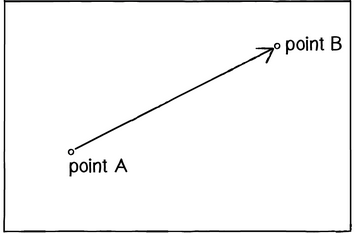

## Capítulo 1. Vetores
*"Entendido. Qual é o nosso vetor, Victor?" - Capitão Oveur (Airplane)*

Este livro é sobre olhar para o mundo ao nosso redor e descobrir maneiras interessantes de simular esse mundo com código. O livro é dividido em três partes, e começa examinando a física básica - como uma maçã cai de uma árvore, como um pêndulo oscila no ar, como a terra gira em torno do sol, etc. Absolutamente tudo contido nos cinco primeiros capítulos deste livro requer o uso do bloco de construção mais básico para a programação de movimento: o **vetor**. E é aqui que começamos nossa história.

A palavra vetor pode significar muitas coisas diferentes. Vector é o nome de uma banda de rock *New Wave* formada em Sacramento  -CA no início dos anos 1980. É o nome de um cereal matinal fabricado pela *Kellogg’s* Canada. No campo da epidemiologia, um vetor é usado para descrever um organismo que transmite a infecção de um hospedeiro para outro. Na linguagem de programação C++, um vetor (std::vector) é uma implementação de uma estrutura de dados de matriz dinamicamente redimensionável. Embora todas essas definições sejam interessantes, elas não são o que procuramos. O que queremos é chamado de **vetor Euclidiano** (em homenagem ao matemático grego Euclides e também conhecido como vetor geométrico). Assim, quando ver o termo "vetor" neste livro, você deve presumir que ele se refere a um vetor euclidiano, definido como uma entidade que possui magnitude e direção.

Um vetor é normalmente desenhado como uma seta; a direção é indicada por onde a seta está apontando, e a magnitude pelo comprimento da própria seta.



Na ilustração acima, o vetor é desenhado como uma seta do ponto A ao ponto B e serve como uma instrução de como viajar de A para B.

### 1.1 Vetores, vocês me completam

Antes de detalharmos mais sobre vetores, vamos dar uma olhada em um exemplo básico no Processing que demonstra por que nós devemos nos preocupar, em primeiro lugar com vetores. Se você leu algum dos livros introdutórios de Processing ou fez uma aula de programação com Processing (e espero que você tenha realmente feito alguma dessas coisas para ajudá-lo neste livro), provavelmente, de uma forma ou outra, aprendeu como para escrever um esboço simples de uma bola quicando.


```java
float x = 100;		// Variáveis para a localização e velocidade da bola.
float y = 100;
float xspeed = 1;
float yspeed = 3.3;

void setup() {		// Se lembra de como Processing funciona?
  size(640,360);		// setup() é executado apenas uma vez quando começa.
  background(255);
}

void draw() {		// draw() executa em loop até você parar.
  background(255);
 
  x = x + xspeed;		// Movimentando a bola de acordo com sua velocidade.
  y = y + yspeed;

  if ((x > width) || (x < 0)) {		// Verificando o quique.
    xspeed = xspeed * -1;
  }
  if ((y > height) || (y < 0)) {
    yspeed = yspeed * -1;
  }
 
  stroke(0);
  fill(175);

  ellipse(x,y,16,16);		// Exibe a localização da bola (x, y).
}
```

No exemplo acima, temos uma situação muito simples - uma tela em branco com uma forma circular (uma "bola") viajando. Essa bola possui algumas propriedades, que são representadas no código como variáveis.

```java
Localização (Location)	// x e y
Velocidade (Speed)		// velocidadeX e velocidadeY
```

Em códigos mais avançados, nós podemos imaginar mais variáveis:

```java
Aceleração	(Acceleration)	// aceleraçãoX e aceleraçãoY
Localização do alvo (Target location)		// alvoX e alvoY
Vento (Wind)		// ventoX e ventoY
Atrito (Friction)		// atritoX e AtritoY
```

Está ficando mais claro que, para cada conceito neste mundo (vento, localização, aceleração, etc.), precisaremos de duas variáveis. E este é apenas um mundo bidimensional. Em um mundo 3D, precisaremos de x, y, z, xspeed, yspeed, zspeed e assim por diante.

Não seria bom se pudéssemos simplificar nosso código e usar menos variáveis?

Ao invés de:

```java
float x;
float y;
float xspeed;
float yspeed;
```

Poderíamos simplesmente ter:

```java
Vector location;
Vector speed;
```

Este primeiro passo com vetores não nos permitirá fazer nada de novo. Apenas adicionar os vetores também não fará com que seus esboços de Processing simulem física. No entanto, eles simplificarão seu código e fornecerão um conjunto de funções para operações matemáticas comuns que ocorrem continuamente durante para programar o movimento.

Como uma introdução aos vetores, vamos viver em duas dimensões por algum tempo (pelo menos até passarmos pelos primeiros capítulos). Todos esses exemplos podem ser facilmente estendidos para três dimensões (e a classe que usaremos - `PVector` - permite três dimensões). No entanto, é mais fácil começar com apenas duas.

### 1.2 Vetores para Programadores em Processing